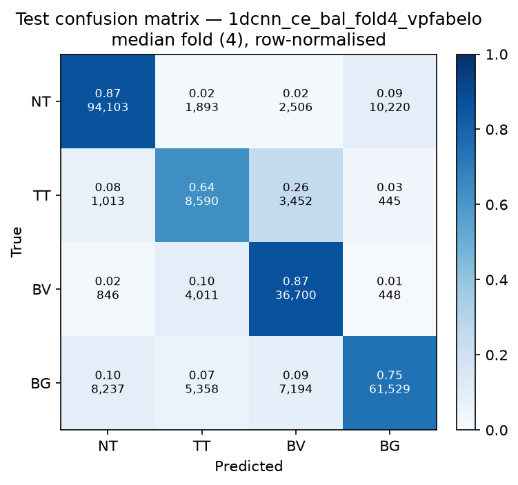

# Test-set evaluation — 1dcnn_ce_bal_vpfabelo

| field | value |
|---|---|
| Model | 1D-CNN (pixel) |
| Loss | CE |
| Strategy | vp_fabelo |
| Folds | 1, 2, 3, 4, 5 |
| Patch size | -- |
| Test images | 15 (012-01, 012-02, 019-01, 022-01, 022-02, 022-03, 037-01, 037-02, 037-03, 037-04, 038-01, 042-01, 042-02, 042-03, 053-01) |
| Labelled pixels | 246,545 |
| Median fold | 4 |
| Device | mps |
| Date | 2026-09-01 |

Metrics from `brainvision.metrics.compute_metrics` (pooled per-fold confusion matrix, labelled pixels only). Aggregate = median ± population std across folds.

## Per-fold results (%)

| Fold | Macro F1 | F1 no-BG | OA | TT Sens | NT F1 | TT F1 | BV F1 | BG F1 | Time (s) |
|---|---|---|---|---|---|---|---|---|---|
| 1 | 74.8 | 73.3 | 80.8 | 83.0 | 88.8 | 55.6 | 75.4 | 79.5 | 1.4 |
| 2 | 76.1 | 74.6 | 81.9 | 70.9 | 88.4 | 57.0 | 78.3 | 80.6 | 1.1 |
| 3 | 78.6 | 77.1 | 84.0 | 65.1 | 89.8 | 61.6 | 80.0 | 82.9 | 1.1 |
| 4 | 74.8 | 73.3 | 81.5 | 63.6 | 88.4 | 51.5 | 79.9 | 79.4 | 1.0 |
| 5 | 72.9 | 71.2 | 80.1 | 61.9 | 87.8 | 48.9 | 76.9 | 78.1 | 1.0 |

## Aggregate (median ± std, %)

| Metric | Median ± Std (%) |
|---|---|
| Macro F1 (all classes) | 74.8 ± 1.9 |
| Macro F1 (excl. Background) | 73.3 ± 2.0  ← primary |
| Overall accuracy | 81.5 ± 1.3 |
| Tumour Tissue sensitivity | 65.1 ± 7.7  ← clinical priority |

## Per-class aggregate (median ± std, %)

| Class | Sensitivity | Specificity | F1 |
|---|---|---|---|
| Normal Tissue (NT) | 86.7 ± 0.5 | 92.7 ± 1.1 | 88.4 ± 0.7 |
| Tumour Tissue (TT)  ← clinical priority | 65.1 ± 7.7 | 95.2 ± 1.3 | 55.6 ± 4.4 |
| Blood Vessel (BV) | 86.7 ± 6.9 | 92.9 ± 1.4 | 78.3 ± 1.8 |
| Background (BG) | 75.0 ± 1.5 | 94.3 ± 1.4 | 79.5 ± 1.6 |

