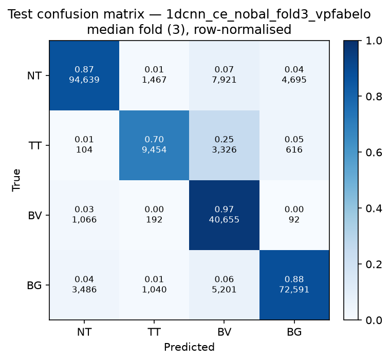

# Test-set evaluation — 1dcnn_ce_nobal_vpfabelo

| field | value |
|---|---|
| Model | 1D-CNN (pixel) |
| Loss | CE |
| Strategy | vp_fabelo |
| Folds | 1, 2, 3, 4, 5 |
| Patch size | -- |
| Test images | 15 (012-01, 012-02, 019-01, 022-01, 022-02, 022-03, 037-01, 037-02, 037-03, 037-04, 038-01, 042-01, 042-02, 042-03, 053-01) |
| Labelled pixels | 246,545 |
| Median fold | 3 |
| Device | mps |
| Date | 2026-09-07 |

Metrics from `brainvision.metrics.compute_metrics` (pooled per-fold confusion matrix, labelled pixels only). Aggregate = median ± population std across folds.

## Per-fold results (%)

| Fold | Macro F1 | F1 no-BG | OA | TT Sens | NT F1 | TT F1 | BV F1 | BG F1 | Time (s) |
|---|---|---|---|---|---|---|---|---|---|
| 1 | 84.6 | 83.3 | 88.7 | 68.6 | 92.4 | 71.6 | 85.9 | 88.3 | 1.2 |
| 2 | 85.0 | 84.7 | 87.7 | 80.4 | 91.3 | 77.0 | 85.9 | 85.9 | 0.5 |
| 3 | 84.3 | 82.2 | 88.2 | 70.0 | 91.0 | 73.7 | 82.0 | 90.6 | 0.5 |
| 4 | 83.0 | 81.4 | 87.8 | 69.6 | 91.4 | 65.9 | 87.0 | 87.6 | 0.5 |
| 5 | 84.1 | 82.2 | 88.9 | 61.0 | 91.4 | 68.4 | 86.9 | 89.8 | 0.5 |

## Aggregate (median ± std, %)

| Metric | Median ± Std (%) |
|---|---|
| Macro F1 (all classes) | 84.3 ± 0.7 |
| Macro F1 (excl. Background) | 82.2 ± 1.1  ← primary |
| Overall accuracy | 88.2 ± 0.5 |
| Tumour Tissue sensitivity | 69.6 ± 6.2  ← clinical priority |

## Per-class aggregate (median ± std, %)

| Class | Sensitivity | Specificity | F1 |
|---|---|---|---|
| Normal Tissue (NT) | 87.0 ± 0.8 | 97.3 ± 0.4 | 91.4 ± 0.5 |
| Tumour Tissue (TT)  ← clinical priority | 69.6 ± 6.2 | 98.7 ± 0.5 | 71.6 ± 3.9 |
| Blood Vessel (BV) | 96.8 ± 0.6 | 94.0 ± 1.0 | 85.9 ± 1.8 |
| Background (BG) | 87.5 ± 2.8 | 93.9 ± 1.3 | 88.3 ± 1.6 |

