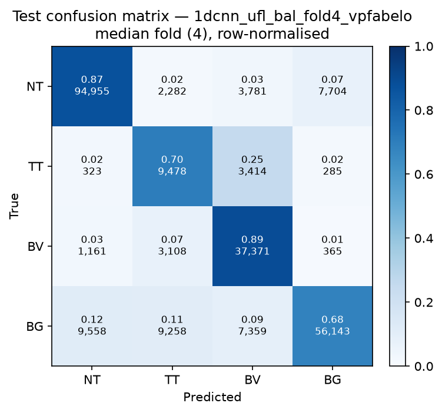

# Test-set evaluation — 1dcnn_ufl_bal_vpfabelo

| field | value |
|---|---|
| Model | 1D-CNN (pixel) |
| Loss | UFL |
| Strategy | vp_fabelo |
| Folds | 1, 2, 3, 4, 5 |
| Patch size | -- |
| Test images | 15 (012-01, 012-02, 019-01, 022-01, 022-02, 022-03, 037-01, 037-02, 037-03, 037-04, 038-01, 042-01, 042-02, 042-03, 053-01) |
| Labelled pixels | 246,545 |
| Median fold | 4 |
| Device | mps |
| Date | 2026-08-31 |

Metrics from `brainvision.metrics.compute_metrics` (pooled per-fold confusion matrix, labelled pixels only). Aggregate = median ± population std across folds.

## Per-fold results (%)

| Fold | Macro F1 | F1 no-BG | OA | TT Sens | NT F1 | TT F1 | BV F1 | BG F1 | Time (s) |
|---|---|---|---|---|---|---|---|---|---|
| 1 | 72.7 | 71.4 | 79.2 | 83.0 | 88.9 | 49.0 | 76.4 | 76.7 | 1.5 |
| 2 | 78.2 | 77.1 | 83.2 | 72.8 | 88.5 | 62.3 | 80.3 | 81.8 | 1.1 |
| 3 | 75.0 | 73.3 | 81.8 | 51.2 | 87.6 | 53.1 | 79.2 | 80.2 | 1.2 |
| 4 | 73.7 | 72.8 | 80.3 | 70.2 | 88.4 | 50.4 | 79.6 | 76.5 | 1.0 |
| 5 | 70.4 | 69.4 | 78.3 | 57.8 | 87.8 | 41.1 | 79.3 | 73.4 | 1.0 |

## Aggregate (median ± std, %)

| Metric | Median ± Std (%) |
|---|---|
| Macro F1 (all classes) | 73.7 ± 2.6 |
| Macro F1 (excl. Background) | 72.8 ± 2.5  ← primary |
| Overall accuracy | 80.3 ± 1.7 |
| Tumour Tissue sensitivity | 70.2 ± 11.3  ← clinical priority |

## Per-class aggregate (median ± std, %)

| Class | Sensitivity | Specificity | F1 |
|---|---|---|---|
| Normal Tissue (NT) | 87.1 ± 0.8 | 92.0 ± 1.5 | 88.4 ± 0.5 |
| Tumour Tissue (TT)  ← clinical priority | 70.2 ± 11.3 | 93.7 ± 2.4 | 50.4 ± 6.8 |
| Blood Vessel (BV) | 89.0 ± 4.5 | 93.1 ± 1.0 | 79.3 ± 1.4 |
| Background (BG) | 69.3 ± 4.1 | 94.3 ± 0.8 | 76.7 ± 2.9 |

