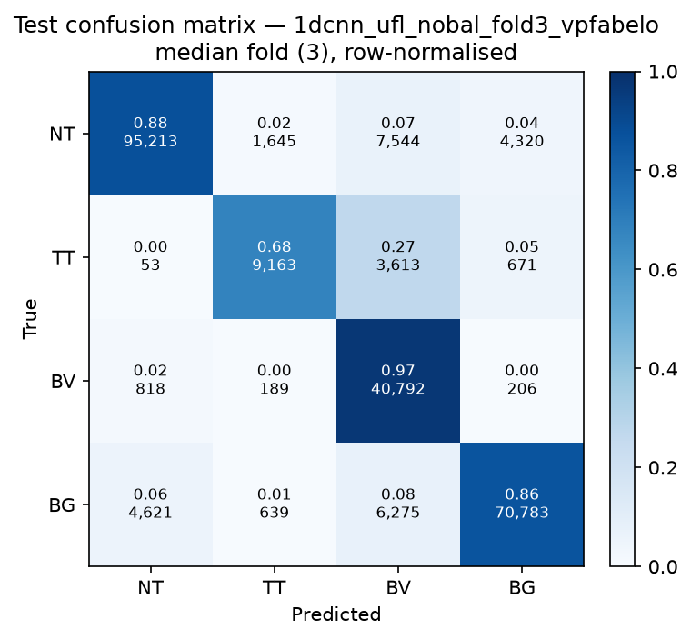

# Test-set evaluation — 1dcnn_ufl_nobal_vpfabelo

| field | value |
|---|---|
| Model | 1D-CNN (pixel) |
| Loss | UFL |
| Strategy | vp_fabelo |
| Folds | 1, 2, 3, 4, 5 |
| Patch size | -- |
| Test images | 15 (012-01, 012-02, 019-01, 022-01, 022-02, 022-03, 037-01, 037-02, 037-03, 037-04, 038-01, 042-01, 042-02, 042-03, 053-01) |
| Labelled pixels | 246,545 |
| Median fold | 3 |
| Device | mps |
| Date | 2026-09-07 |

Metrics from `brainvision.metrics.compute_metrics` (pooled per-fold confusion matrix, labelled pixels only). Aggregate = median ± population std across folds.

## Per-fold results (%)

| Fold | Macro F1 | F1 no-BG | OA | TT Sens | NT F1 | TT F1 | BV F1 | BG F1 | Time (s) |
|---|---|---|---|---|---|---|---|---|---|
| 1 | 84.3 | 83.3 | 87.8 | 66.7 | 90.9 | 73.1 | 85.8 | 87.2 | 0.6 |
| 2 | 81.3 | 79.9 | 86.6 | 52.4 | 91.0 | 64.6 | 84.2 | 85.3 | 0.6 |
| 3 | 83.7 | 81.7 | 87.6 | 67.9 | 90.9 | 72.9 | 81.4 | 89.4 | 0.5 |
| 4 | 81.9 | 80.0 | 87.3 | 56.4 | 91.6 | 64.9 | 83.5 | 87.5 | 0.6 |
| 5 | 83.4 | 82.1 | 87.9 | 56.1 | 92.0 | 70.8 | 83.5 | 87.5 | 0.6 |

## Aggregate (median ± std, %)

| Metric | Median ± Std (%) |
|---|---|
| Macro F1 (all classes) | 83.4 ± 1.1 |
| Macro F1 (excl. Background) | 81.7 ± 1.3  ← primary |
| Overall accuracy | 87.6 ± 0.5 |
| Tumour Tissue sensitivity | 56.4 ± 6.2  ← clinical priority |

## Per-class aggregate (median ± std, %)

| Class | Sensitivity | Specificity | F1 |
|---|---|---|---|
| Normal Tissue (NT) | 87.0 ± 0.5 | 97.3 ± 0.7 | 91.0 ± 0.4 |
| Tumour Tissue (TT)  ← clinical priority | 56.4 ± 6.2 | 99.1 ± 0.3 | 70.8 ± 3.8 |
| Blood Vessel (BV) | 96.8 ± 0.7 | 93.1 ± 0.9 | 83.5 ± 1.4 |
| Background (BG) | 87.5 ± 1.4 | 92.3 ± 1.9 | 87.5 ± 1.3 |

