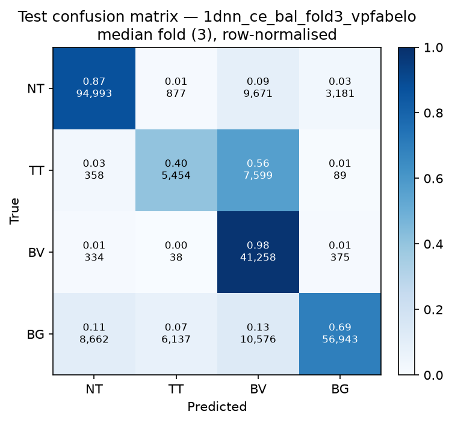

# Test-set evaluation — 1dnn_ce_bal_vpfabelo

| field | value |
|---|---|
| Model | 1D-NN (pixel) |
| Loss | CE |
| Strategy | vp_fabelo |
| Folds | 1, 2, 3, 4, 5 |
| Patch size | -- |
| Test images | 15 (012-01, 012-02, 019-01, 022-01, 022-02, 022-03, 037-01, 037-02, 037-03, 037-04, 038-01, 042-01, 042-02, 042-03, 053-01) |
| Labelled pixels | 246,545 |
| Median fold | 3 |
| Device | mps |
| Date | 2026-08-31 |

Metrics from `brainvision.metrics.compute_metrics` (pooled per-fold confusion matrix, labelled pixels only). Aggregate = median ± population std across folds.

## Per-fold results (%)

| Fold | Macro F1 | F1 no-BG | OA | TT Sens | NT F1 | TT F1 | BV F1 | BG F1 | Time (s) |
|---|---|---|---|---|---|---|---|---|---|
| 1 | 65.0 | 65.9 | 71.1 | 85.7 | 86.3 | 34.3 | 77.2 | 62.1 | 7.8 |
| 2 | 73.8 | 72.3 | 81.8 | 52.0 | 89.5 | 44.6 | 82.7 | 78.4 | 7.4 |
| 3 | 71.3 | 68.5 | 80.6 | 40.4 | 89.2 | 41.9 | 74.3 | 79.7 | 7.3 |
| 4 | 69.1 | 67.3 | 78.3 | 51.4 | 88.6 | 33.9 | 79.4 | 74.7 | 7.3 |
| 5 | 72.6 | 71.6 | 79.9 | 50.5 | 87.5 | 49.2 | 78.2 | 75.7 | 7.3 |

## Aggregate (median ± std, %)

| Metric | Median ± Std (%) |
|---|---|
| Macro F1 (all classes) | 71.3 ± 3.1 |
| Macro F1 (excl. Background) | 68.5 ± 2.5  ← primary |
| Overall accuracy | 79.9 ± 3.8 |
| Tumour Tissue sensitivity | 51.4 ± 15.4  ← clinical priority |

## Per-class aggregate (median ± std, %)

| Class | Sensitivity | Specificity | F1 |
|---|---|---|---|
| Normal Tissue (NT) | 86.7 ± 2.0 | 93.2 ± 1.4 | 88.6 ± 1.2 |
| Tumour Tissue (TT)  ← clinical priority | 51.4 ± 15.4 | 95.3 ± 5.7 | 41.9 ± 5.9 |
| Blood Vessel (BV) | 94.2 ± 7.0 | 92.5 ± 3.0 | 78.2 ± 2.8 |
| Background (BG) | 66.5 ± 8.2 | 95.4 ± 1.8 | 75.7 ± 6.3 |

