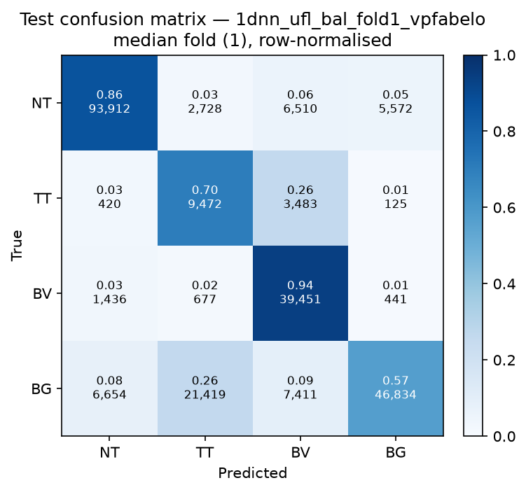

# Test-set evaluation — 1dnn_ufl_bal_vpfabelo

| field | value |
|---|---|
| Model | 1D-NN (pixel) |
| Loss | UFL |
| Strategy | vp_fabelo |
| Folds | 1, 2, 3, 4, 5 |
| Patch size | -- |
| Test images | 15 (012-01, 012-02, 019-01, 022-01, 022-02, 022-03, 037-01, 037-02, 037-03, 037-04, 038-01, 042-01, 042-02, 042-03, 053-01) |
| Labelled pixels | 246,545 |
| Median fold | 1 |
| Device | mps |
| Date | 2026-08-31 |

Metrics from `brainvision.metrics.compute_metrics` (pooled per-fold confusion matrix, labelled pixels only). Aggregate = median ± population std across folds.

## Per-fold results (%)

| Fold | Macro F1 | F1 no-BG | OA | TT Sens | NT F1 | TT F1 | BV F1 | BG F1 | Time (s) |
|---|---|---|---|---|---|---|---|---|---|
| 1 | 69.4 | 69.5 | 76.9 | 70.2 | 89.0 | 39.6 | 79.8 | 69.2 | 7.5 |
| 2 | 73.3 | 71.3 | 82.0 | 45.8 | 89.7 | 42.9 | 81.4 | 79.2 | 7.3 |
| 3 | 71.7 | 70.2 | 79.7 | 54.7 | 87.9 | 44.5 | 78.0 | 76.4 | 7.4 |
| 4 | 69.3 | 66.4 | 79.6 | 39.9 | 89.5 | 33.6 | 76.1 | 77.8 | 7.3 |
| 5 | 70.1 | 68.9 | 78.4 | 52.6 | 87.9 | 42.7 | 76.1 | 73.8 | 7.3 |

## Aggregate (median ± std, %)

| Metric | Median ± Std (%) |
|---|---|
| Macro F1 (all classes) | 70.1 ± 1.5 |
| Macro F1 (excl. Background) | 69.5 ± 1.6  ← primary |
| Overall accuracy | 79.6 ± 1.7 |
| Tumour Tissue sensitivity | 52.6 ± 10.2  ← clinical priority |

## Per-class aggregate (median ± std, %)

| Class | Sensitivity | Specificity | F1 |
|---|---|---|---|
| Normal Tissue (NT) | 86.9 ± 0.5 | 93.8 ± 1.7 | 89.0 ± 0.8 |
| Tumour Tissue (TT)  ← clinical priority | 52.6 ± 10.2 | 94.6 ± 2.3 | 42.7 ± 3.9 |
| Blood Vessel (BV) | 93.9 ± 1.5 | 89.7 ± 1.0 | 78.0 ± 2.1 |
| Background (BG) | 64.7 ± 5.9 | 95.9 ± 1.3 | 76.4 ± 3.5 |

