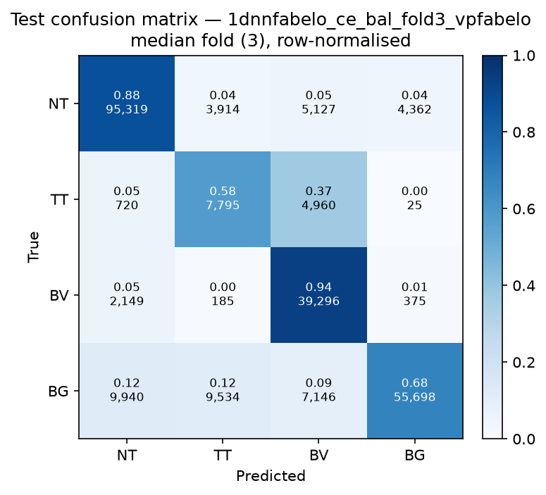

# Test-set evaluation — 1dnnfabelo_ce_bal_vpfabelo

| field | value |
|---|---|
| Model | 1D-NN-Fabelo (pixel) |
| Loss | CE |
| Strategy | vp_fabelo |
| Folds | 1, 2, 3, 4, 5 |
| Patch size | -- |
| Test images | 15 (012-01, 012-02, 019-01, 022-01, 022-02, 022-03, 037-01, 037-02, 037-03, 037-04, 038-01, 042-01, 042-02, 042-03, 053-01) |
| Labelled pixels | 246,545 |
| Median fold | 3 |
| Device | mps |
| Date | 2026-08-31 |

Metrics from `brainvision.metrics.compute_metrics` (pooled per-fold confusion matrix, labelled pixels only). Aggregate = median ± population std across folds.

## Per-fold results (%)

| Fold | Macro F1 | F1 no-BG | OA | TT Sens | NT F1 | TT F1 | BV F1 | BG F1 | Time (s) |
|---|---|---|---|---|---|---|---|---|---|
| 1 | 70.2 | 66.5 | 78.4 | 75.6 | 88.4 | 42.9 | 68.1 | 81.2 | 1.2 |
| 2 | 69.9 | 67.4 | 77.8 | 64.3 | 87.9 | 34.8 | 79.6 | 77.4 | 0.6 |
| 3 | 72.6 | 70.8 | 80.4 | 57.7 | 87.9 | 44.6 | 79.8 | 78.0 | 0.6 |
| 4 | 76.9 | 75.2 | 83.5 | 62.4 | 90.6 | 55.9 | 79.1 | 82.1 | 0.6 |
| 5 | 72.7 | 72.2 | 79.7 | 45.0 | 85.9 | 50.3 | 80.3 | 74.1 | 0.6 |

## Aggregate (median ± std, %)

| Metric | Median ± Std (%) |
|---|---|
| Macro F1 (all classes) | 72.6 ± 2.5 |
| Macro F1 (excl. Background) | 70.8 ± 3.2  ← primary |
| Overall accuracy | 79.7 ± 2.0 |
| Tumour Tissue sensitivity | 62.4 ± 9.9  ← clinical priority |

## Per-class aggregate (median ± std, %)

| Class | Sensitivity | Specificity | F1 |
|---|---|---|---|
| Normal Tissue (NT) | 87.7 ± 3.2 | 93.8 ± 4.5 | 87.9 ± 1.5 |
| Tumour Tissue (TT)  ← clinical priority | 62.4 ± 9.9 | 94.2 ± 3.8 | 44.6 ± 7.1 |
| Blood Vessel (BV) | 92.5 ± 10.6 | 91.6 ± 1.3 | 79.6 ± 4.7 |
| Background (BG) | 71.7 ± 4.8 | 95.5 ± 1.3 | 78.0 ± 2.8 |

