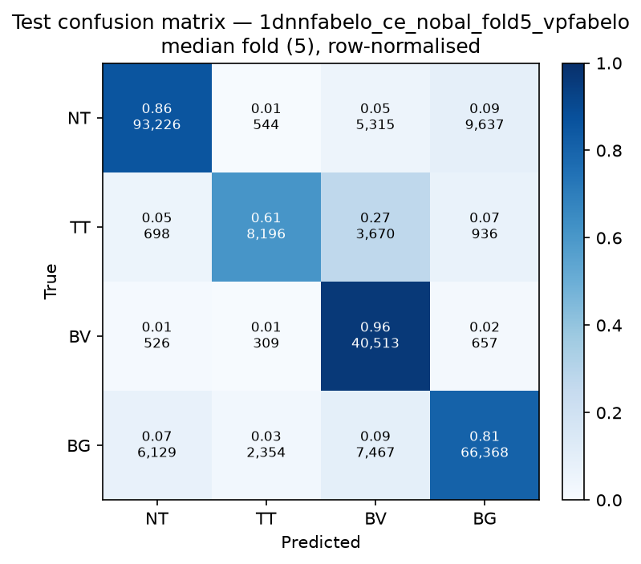

# Test-set evaluation — 1dnnfabelo_ce_nobal_vpfabelo

| field | value |
|---|---|
| Model | 1D-NN-Fabelo (pixel) |
| Loss | CE |
| Strategy | vp_fabelo |
| Folds | 1, 2, 3, 4, 5 |
| Patch size | -- |
| Test images | 15 (012-01, 012-02, 019-01, 022-01, 022-02, 022-03, 037-01, 037-02, 037-03, 037-04, 038-01, 042-01, 042-02, 042-03, 053-01) |
| Labelled pixels | 246,545 |
| Median fold | 5 |
| Device | mps |
| Date | 2026-09-07 |

Metrics from `brainvision.metrics.compute_metrics` (pooled per-fold confusion matrix, labelled pixels only). Aggregate = median ± population std across folds.

## Per-fold results (%)

| Fold | Macro F1 | F1 no-BG | OA | TT Sens | NT F1 | TT F1 | BV F1 | BG F1 | Time (s) |
|---|---|---|---|---|---|---|---|---|---|
| 1 | 81.2 | 80.4 | 85.1 | 65.6 | 89.7 | 69.7 | 81.9 | 83.4 | 0.4 |
| 2 | 71.6 | 68.1 | 82.9 | 29.3 | 89.6 | 32.3 | 82.3 | 82.2 | 0.4 |
| 3 | 78.3 | 76.0 | 84.3 | 70.4 | 89.4 | 57.8 | 80.9 | 85.3 | 0.3 |
| 4 | 81.6 | 81.2 | 85.6 | 60.0 | 90.5 | 69.9 | 83.1 | 83.1 | 0.3 |
| 5 | 79.9 | 78.9 | 84.5 | 60.7 | 89.1 | 65.8 | 81.9 | 83.0 | 0.3 |

## Aggregate (median ± std, %)

| Metric | Median ± Std (%) |
|---|---|
| Macro F1 (all classes) | 79.9 ± 3.7 |
| Macro F1 (excl. Background) | 78.9 ± 4.8  ← primary |
| Overall accuracy | 84.5 ± 0.9 |
| Tumour Tissue sensitivity | 60.7 ± 14.4  ← clinical priority |

## Per-class aggregate (median ± std, %)

| Class | Sensitivity | Specificity | F1 |
|---|---|---|---|
| Normal Tissue (NT) | 86.4 ± 0.6 | 94.7 ± 0.6 | 89.6 ± 0.5 |
| Tumour Tissue (TT)  ← clinical priority | 60.7 ± 14.4 | 98.6 ± 1.3 | 65.8 ± 14.1 |
| Blood Vessel (BV) | 95.5 ± 1.3 | 92.1 ± 0.4 | 81.9 ± 0.7 |
| Background (BG) | 80.6 ± 1.4 | 92.8 ± 1.9 | 83.1 ± 1.0 |

