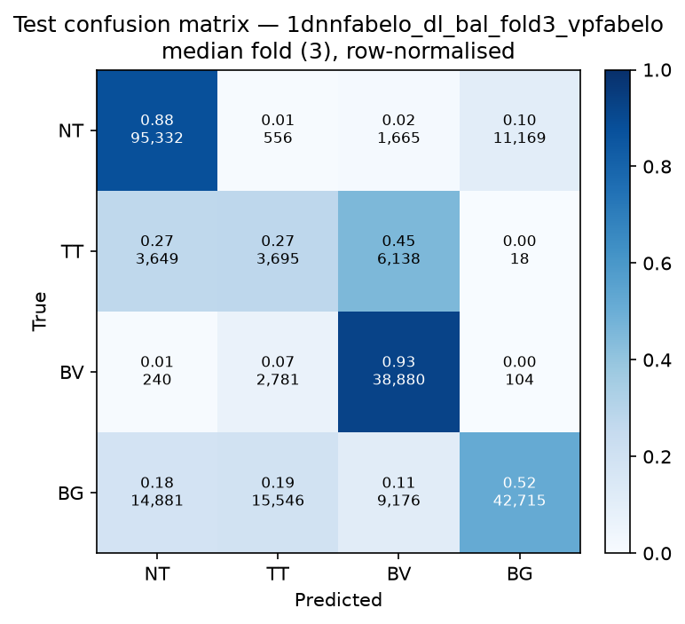

# Test-set evaluation — 1dnnfabelo_dl_bal_vpfabelo

| field | value |
|---|---|
| Model | 1D-NN-Fabelo (pixel) |
| Loss | DL |
| Strategy | vp_fabelo |
| Folds | 1, 2, 3, 4, 5 |
| Patch size | -- |
| Test images | 15 (012-01, 012-02, 019-01, 022-01, 022-02, 022-03, 037-01, 037-02, 037-03, 037-04, 038-01, 042-01, 042-02, 042-03, 053-01) |
| Labelled pixels | 246,545 |
| Median fold | 3 |
| Device | mps |
| Date | 2026-08-31 |

Metrics from `brainvision.metrics.compute_metrics` (pooled per-fold confusion matrix, labelled pixels only). Aggregate = median ± population std across folds.

## Per-fold results (%)

| Fold | Macro F1 | F1 no-BG | OA | TT Sens | NT F1 | TT F1 | BV F1 | BG F1 | Time (s) |
|---|---|---|---|---|---|---|---|---|---|
| 1 | 47.0 | 41.7 | 64.7 | 0.1 | 72.7 | 0.2 | 52.2 | 62.8 | 0.8 |
| 2 | 66.1 | 64.1 | 76.0 | 39.2 | 87.4 | 23.3 | 81.5 | 72.0 | 0.7 |
| 3 | 62.0 | 61.8 | 73.3 | 27.4 | 85.6 | 20.5 | 79.5 | 62.7 | 0.6 |
| 4 | 70.6 | 68.7 | 78.5 | 64.5 | 88.0 | 36.7 | 81.4 | 76.4 | 0.6 |
| 5 | 59.5 | 61.1 | 71.5 | 24.3 | 85.9 | 16.1 | 81.3 | 54.8 | 0.6 |

## Aggregate (median ± std, %)

| Metric | Median ± Std (%) |
|---|---|
| Macro F1 (all classes) | 62.0 ± 8.0 |
| Macro F1 (excl. Background) | 61.8 ± 9.3  ← primary |
| Overall accuracy | 73.3 ± 4.7 |
| Tumour Tissue sensitivity | 27.4 ± 21.0  ← clinical priority |

## Per-class aggregate (median ± std, %)

| Class | Sensitivity | Specificity | F1 |
|---|---|---|---|
| Normal Tissue (NT) | 87.7 ± 1.9 | 86.4 ± 13.3 | 85.9 ± 5.7 |
| Tumour Tissue (TT)  ← clinical priority | 27.4 ± 21.0 | 89.7 ± 4.2 | 20.5 ± 11.8 |
| Blood Vessel (BV) | 92.6 ± 18.7 | 92.6 ± 0.8 | 81.3 ± 11.5 |
| Background (BG) | 53.0 ± 8.3 | 95.8 ± 2.0 | 62.8 ± 7.6 |

