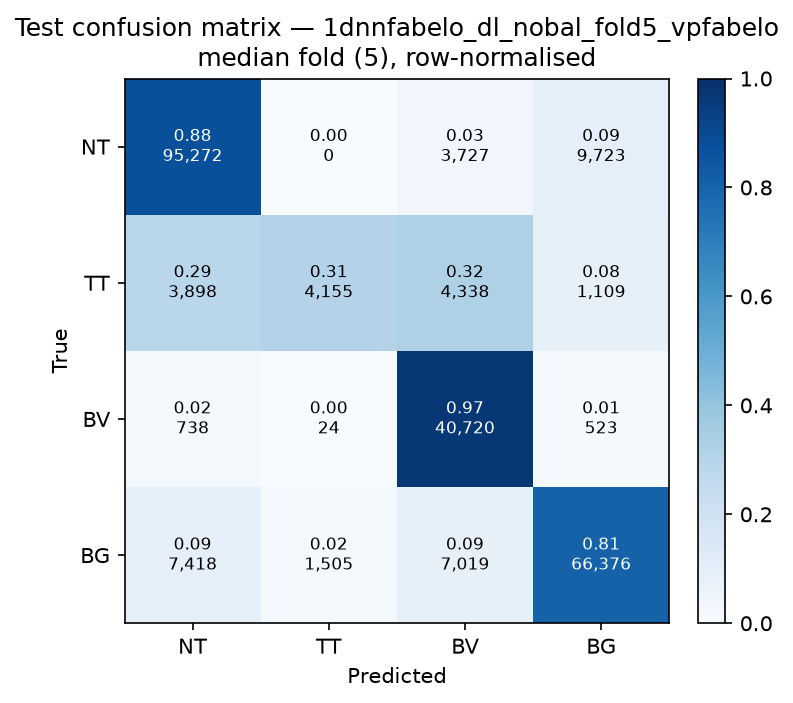

# Test-set evaluation — 1dnnfabelo_dl_nobal_vpfabelo

| field | value |
|---|---|
| Model | 1D-NN-Fabelo (pixel) |
| Loss | DL |
| Strategy | vp_fabelo |
| Folds | 1, 2, 3, 4, 5 |
| Patch size | -- |
| Test images | 15 (012-01, 012-02, 019-01, 022-01, 022-02, 022-03, 037-01, 037-02, 037-03, 037-04, 038-01, 042-01, 042-02, 042-03, 053-01) |
| Labelled pixels | 246,545 |
| Median fold | 5 |
| Device | mps |
| Date | 2026-09-07 |

Metrics from `brainvision.metrics.compute_metrics` (pooled per-fold confusion matrix, labelled pixels only). Aggregate = median ± population std across folds.

## Per-fold results (%)

| Fold | Macro F1 | F1 no-BG | OA | TT Sens | NT F1 | TT F1 | BV F1 | BG F1 | Time (s) |
|---|---|---|---|---|---|---|---|---|---|
| 1 | 74.6 | 71.8 | 83.6 | 32.5 | 89.3 | 46.2 | 80.0 | 82.9 | 0.4 |
| 2 | 74.6 | 71.7 | 83.6 | 42.3 | 89.0 | 41.9 | 84.1 | 83.3 | 0.4 |
| 3 | 71.4 | 67.3 | 82.7 | 30.8 | 88.8 | 31.0 | 82.0 | 83.7 | 0.4 |
| 4 | 73.0 | 69.2 | 83.5 | 34.3 | 88.7 | 35.3 | 83.5 | 84.4 | 0.4 |
| 5 | 74.4 | 71.6 | 83.8 | 30.8 | 88.2 | 43.3 | 83.3 | 82.9 | 0.3 |

## Aggregate (median ± std, %)

| Metric | Median ± Std (%) |
|---|---|
| Macro F1 (all classes) | 74.4 ± 1.3 |
| Macro F1 (excl. Background) | 71.6 ± 1.8  ← primary |
| Overall accuracy | 83.6 ± 0.4 |
| Tumour Tissue sensitivity | 32.5 ± 4.3  ← clinical priority |

## Per-class aggregate (median ± std, %)

| Class | Sensitivity | Specificity | F1 |
|---|---|---|---|
| Normal Tissue (NT) | 86.6 ± 0.5 | 93.4 ± 1.0 | 88.8 ± 0.4 |
| Tumour Tissue (TT)  ← clinical priority | 32.5 ± 4.3 | 96.5 ± 1.5 | 41.9 ± 5.6 |
| Blood Vessel (BV) | 94.7 ± 2.0 | 92.6 ± 1.3 | 83.3 ± 1.5 |
| Background (BG) | 81.8 ± 1.1 | 93.0 ± 0.7 | 83.3 ± 0.6 |

