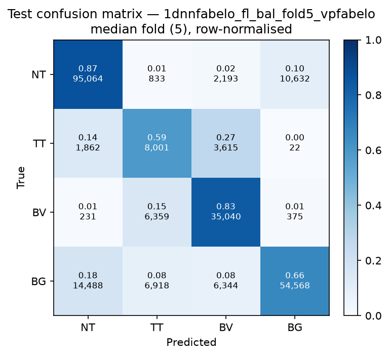

# Test-set evaluation — 1dnnfabelo_fl_bal_vpfabelo

| field | value |
|---|---|
| Model | 1D-NN-Fabelo (pixel) |
| Loss | FL |
| Strategy | vp_fabelo |
| Folds | 1, 2, 3, 4, 5 |
| Patch size | -- |
| Test images | 15 (012-01, 012-02, 019-01, 022-01, 022-02, 022-03, 037-01, 037-02, 037-03, 037-04, 038-01, 042-01, 042-02, 042-03, 053-01) |
| Labelled pixels | 246,545 |
| Median fold | 5 |
| Device | mps |
| Date | 2026-08-31 |

Metrics from `brainvision.metrics.compute_metrics` (pooled per-fold confusion matrix, labelled pixels only). Aggregate = median ± population std across folds.

## Per-fold results (%)

| Fold | Macro F1 | F1 no-BG | OA | TT Sens | NT F1 | TT F1 | BV F1 | BG F1 | Time (s) |
|---|---|---|---|---|---|---|---|---|---|
| 1 | 68.4 | 67.1 | 75.4 | 77.3 | 87.7 | 37.0 | 76.6 | 72.4 | 0.8 |
| 2 | 70.3 | 67.2 | 80.7 | 38.5 | 89.0 | 31.3 | 81.3 | 79.5 | 0.7 |
| 3 | 72.4 | 71.0 | 80.0 | 58.2 | 88.1 | 45.5 | 79.6 | 76.5 | 0.6 |
| 4 | 79.4 | 78.6 | 84.2 | 57.7 | 88.7 | 63.0 | 84.1 | 81.7 | 0.6 |
| 5 | 70.9 | 69.9 | 78.1 | 59.3 | 86.3 | 44.9 | 78.6 | 73.8 | 0.6 |

## Aggregate (median ± std, %)

| Metric | Median ± Std (%) |
|---|---|
| Macro F1 (all classes) | 70.9 ± 3.8 |
| Macro F1 (excl. Background) | 69.9 ± 4.2  ← primary |
| Overall accuracy | 80.0 ± 2.9 |
| Tumour Tissue sensitivity | 58.2 ± 12.3  ← clinical priority |

## Per-class aggregate (median ± std, %)

| Class | Sensitivity | Specificity | F1 |
|---|---|---|---|
| Normal Tissue (NT) | 86.6 ± 1.8 | 93.3 ± 2.6 | 88.1 ± 1.0 |
| Tumour Tissue (TT)  ← clinical priority | 58.2 ± 12.3 | 93.9 ± 4.0 | 44.9 ± 10.7 |
| Blood Vessel (BV) | 91.6 ± 5.7 | 93.4 ± 0.9 | 79.6 ± 2.6 |
| Background (BG) | 67.6 ± 6.0 | 93.7 ± 1.1 | 76.5 ± 3.5 |

