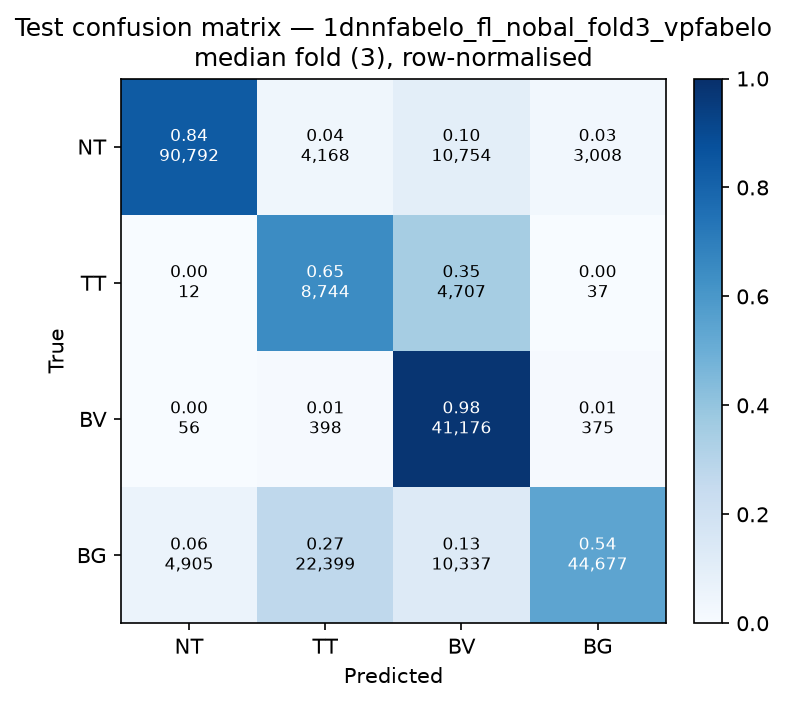

# Test-set evaluation — 1dnnfabelo_fl_nobal_vpfabelo

| field | value |
|---|---|
| Model | 1D-NN-Fabelo (pixel) |
| Loss | FL |
| Strategy | vp_fabelo |
| Folds | 1, 2, 3, 4, 5 |
| Patch size | -- |
| Test images | 15 (012-01, 012-02, 019-01, 022-01, 022-02, 022-03, 037-01, 037-02, 037-03, 037-04, 038-01, 042-01, 042-02, 042-03, 053-01) |
| Labelled pixels | 246,545 |
| Median fold | 3 |
| Device | mps |
| Date | 2026-09-07 |

Metrics from `brainvision.metrics.compute_metrics` (pooled per-fold confusion matrix, labelled pixels only). Aggregate = median ± population std across folds.

## Per-fold results (%)

| Fold | Macro F1 | F1 no-BG | OA | TT Sens | NT F1 | TT F1 | BV F1 | BG F1 | Time (s) |
|---|---|---|---|---|---|---|---|---|---|
| 1 | 63.4 | 64.8 | 70.5 | 70.9 | 88.3 | 28.0 | 78.1 | 59.1 | 0.7 |
| 2 | 66.2 | 66.9 | 73.7 | 73.7 | 89.7 | 33.0 | 78.1 | 64.0 | 0.4 |
| 3 | 67.1 | 66.6 | 75.2 | 64.8 | 88.8 | 35.5 | 75.6 | 68.5 | 0.5 |
| 4 | 64.2 | 65.6 | 71.6 | 74.8 | 88.8 | 32.3 | 75.8 | 59.9 | 0.4 |
| 5 | 67.6 | 68.9 | 75.2 | 74.5 | 89.9 | 38.5 | 78.4 | 63.6 | 0.4 |

## Aggregate (median ± std, %)

| Metric | Median ± Std (%) |
|---|---|
| Macro F1 (all classes) | 66.2 ± 1.6 |
| Macro F1 (excl. Background) | 66.6 ± 1.4  ← primary |
| Overall accuracy | 73.7 ± 1.9 |
| Tumour Tissue sensitivity | 73.7 ± 3.7  ← clinical priority |

## Per-class aggregate (median ± std, %)

| Class | Sensitivity | Specificity | F1 |
|---|---|---|---|
| Normal Tissue (NT) | 83.8 ± 1.8 | 96.4 ± 1.1 | 88.8 ± 0.6 |
| Tumour Tissue (TT)  ← clinical priority | 73.7 ± 3.7 | 84.1 ± 2.9 | 33.0 ± 3.5 |
| Blood Vessel (BV) | 95.5 ± 2.7 | 90.1 ± 1.1 | 78.1 ± 1.2 |
| Background (BG) | 50.1 ± 3.5 | 96.7 ± 0.6 | 63.6 ± 3.4 |

