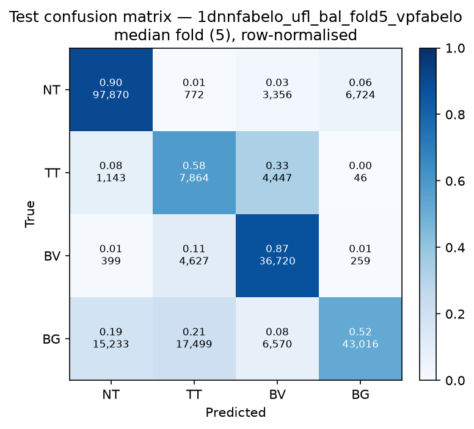

# Test-set evaluation — 1dnnfabelo_ufl_bal_vpfabelo

| field | value |
|---|---|
| Model | 1D-NN-Fabelo (pixel) |
| Loss | UFL |
| Strategy | vp_fabelo |
| Folds | 1, 2, 3, 4, 5 |
| Patch size | -- |
| Test images | 15 (012-01, 012-02, 019-01, 022-01, 022-02, 022-03, 037-01, 037-02, 037-03, 037-04, 038-01, 042-01, 042-02, 042-03, 053-01) |
| Labelled pixels | 246,545 |
| Median fold | 5 |
| Device | mps |
| Date | 2026-08-31 |

Metrics from `brainvision.metrics.compute_metrics` (pooled per-fold confusion matrix, labelled pixels only). Aggregate = median ± population std across folds.

## Per-fold results (%)

| Fold | Macro F1 | F1 no-BG | OA | TT Sens | NT F1 | TT F1 | BV F1 | BG F1 | Time (s) |
|---|---|---|---|---|---|---|---|---|---|
| 1 | 68.2 | 64.4 | 77.0 | 74.7 | 88.4 | 39.7 | 65.0 | 79.9 | 0.8 |
| 2 | 67.8 | 65.1 | 77.6 | 48.1 | 89.1 | 31.0 | 75.2 | 76.0 | 0.7 |
| 3 | 73.2 | 72.4 | 79.7 | 59.6 | 86.8 | 51.9 | 78.5 | 75.7 | 0.7 |
| 4 | 72.2 | 71.0 | 79.5 | 64.9 | 88.3 | 45.4 | 79.1 | 76.0 | 0.6 |
| 5 | 66.8 | 67.4 | 75.2 | 58.3 | 87.6 | 35.5 | 78.9 | 65.0 | 0.6 |

## Aggregate (median ± std, %)

| Metric | Median ± Std (%) |
|---|---|
| Macro F1 (all classes) | 68.2 ± 2.6 |
| Macro F1 (excl. Background) | 67.4 ± 3.2  ← primary |
| Overall accuracy | 77.6 ± 1.7 |
| Tumour Tissue sensitivity | 59.6 ± 8.7  ← clinical priority |

## Per-class aggregate (median ± std, %)

| Class | Sensitivity | Specificity | F1 |
|---|---|---|---|
| Normal Tissue (NT) | 86.6 ± 1.5 | 92.6 ± 2.6 | 88.3 ± 0.8 |
| Tumour Tissue (TT)  ← clinical priority | 59.6 ± 8.7 | 90.6 ± 2.6 | 39.7 ± 7.3 |
| Blood Vessel (BV) | 87.4 ± 10.7 | 93.0 ± 0.8 | 78.5 ± 5.4 |
| Background (BG) | 67.2 ± 7.2 | 95.2 ± 0.9 | 76.0 ± 5.0 |

