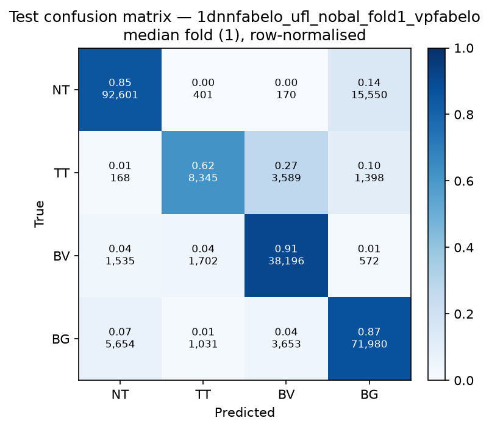

# Test-set evaluation — 1dnnfabelo_ufl_nobal_vpfabelo

| field | value |
|---|---|
| Model | 1D-NN-Fabelo (pixel) |
| Loss | UFL |
| Strategy | vp_fabelo |
| Folds | 1, 2, 3, 4, 5 |
| Patch size | -- |
| Test images | 15 (012-01, 012-02, 019-01, 022-01, 022-02, 022-03, 037-01, 037-02, 037-03, 037-04, 038-01, 042-01, 042-02, 042-03, 053-01) |
| Labelled pixels | 246,545 |
| Median fold | 1 |
| Device | mps |
| Date | 2026-09-07 |

Metrics from `brainvision.metrics.compute_metrics` (pooled per-fold confusion matrix, labelled pixels only). Aggregate = median ± population std across folds.

## Per-fold results (%)

| Fold | Macro F1 | F1 no-BG | OA | TT Sens | NT F1 | TT F1 | BV F1 | BG F1 | Time (s) |
|---|---|---|---|---|---|---|---|---|---|
| 1 | 81.6 | 80.9 | 85.6 | 61.8 | 88.7 | 66.8 | 87.2 | 83.8 | 0.6 |
| 2 | 80.2 | 79.2 | 84.9 | 60.0 | 89.5 | 65.5 | 82.6 | 83.1 | 0.5 |
| 3 | 83.9 | 83.2 | 86.1 | 76.7 | 89.1 | 78.5 | 82.0 | 85.9 | 0.4 |
| 4 | 82.1 | 81.6 | 85.5 | 70.7 | 89.3 | 71.2 | 84.5 | 83.5 | 0.3 |
| 5 | 80.0 | 79.1 | 85.0 | 61.2 | 90.1 | 64.5 | 82.7 | 82.6 | 0.3 |

## Aggregate (median ± std, %)

| Metric | Median ± Std (%) |
|---|---|
| Macro F1 (all classes) | 81.6 ± 1.4 |
| Macro F1 (excl. Background) | 80.9 ± 1.5  ← primary |
| Overall accuracy | 85.5 ± 0.4 |
| Tumour Tissue sensitivity | 61.8 ± 6.5  ← clinical priority |

## Per-class aggregate (median ± std, %)

| Class | Sensitivity | Specificity | F1 |
|---|---|---|---|
| Normal Tissue (NT) | 86.9 ± 1.5 | 94.1 ± 0.7 | 89.3 ± 0.5 |
| Tumour Tissue (TT)  ← clinical priority | 61.8 ± 6.5 | 98.6 ± 0.2 | 66.8 ± 5.1 |
| Blood Vessel (BV) | 96.0 ± 2.5 | 93.4 ± 1.6 | 82.7 ± 1.9 |
| Background (BG) | 81.1 ± 3.2 | 94.2 ± 2.2 | 83.5 ± 1.1 |

