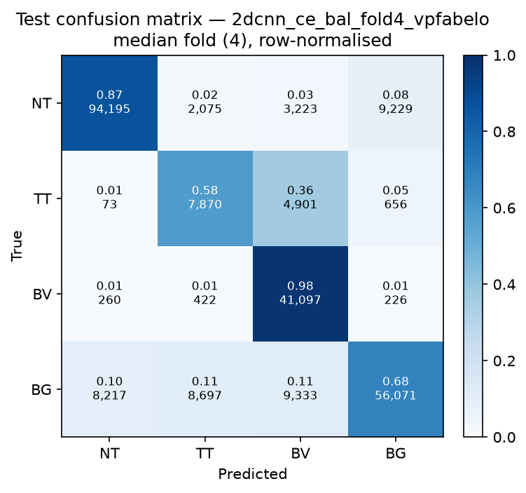

# Test-set evaluation — 2dcnn_ce_bal_vpfabelo

| field | value |
|---|---|
| Model | 2D-CNN (patch) |
| Loss | CE |
| Strategy | vp_fabelo |
| Folds | 1, 2, 3, 4, 5 |
| Patch size | 11 |
| Test images | 15 (012-01, 012-02, 019-01, 022-01, 022-02, 022-03, 037-01, 037-02, 037-03, 037-04, 038-01, 042-01, 042-02, 042-03, 053-01) |
| Labelled pixels | 246,545 |
| Median fold | 4 |
| Device | mps |
| Date | 2026-09-07 |

Metrics from `brainvision.metrics.compute_metrics` (pooled per-fold confusion matrix, labelled pixels only). Aggregate = median ± population std across folds.

## Per-fold results (%)

| Fold | Macro F1 | F1 no-BG | OA | TT Sens | NT F1 | TT F1 | BV F1 | BG F1 | Time (s) |
|---|---|---|---|---|---|---|---|---|---|
| 1 | 74.8 | 74.5 | 80.8 | 74.5 | 88.8 | 51.5 | 83.1 | 75.8 | 158.8 |
| 2 | 71.8 | 68.3 | 81.7 | 46.9 | 90.2 | 32.1 | 82.6 | 82.4 | 155.0 |
| 3 | 66.9 | 62.4 | 79.0 | 28.1 | 89.1 | 24.2 | 73.7 | 80.5 | 157.1 |
| 4 | 73.7 | 73.1 | 80.8 | 58.3 | 89.1 | 48.3 | 81.7 | 75.5 | 155.3 |
| 5 | 76.1 | 75.1 | 82.5 | 61.5 | 89.4 | 53.9 | 81.9 | 79.3 | 155.0 |

## Aggregate (median ± std, %)

| Metric | Median ± Std (%) |
|---|---|
| Macro F1 (all classes) | 73.7 ± 3.2 |
| Macro F1 (excl. Background) | 73.1 ± 4.8  ← primary |
| Overall accuracy | 80.8 ± 1.2 |
| Tumour Tissue sensitivity | 58.3 ± 15.6  ← clinical priority |

## Per-class aggregate (median ± std, %)

| Class | Sensitivity | Specificity | F1 |
|---|---|---|---|
| Normal Tissue (NT) | 85.9 ± 1.3 | 95.0 ± 1.6 | 89.1 ± 0.5 |
| Tumour Tissue (TT)  ← clinical priority | 58.3 ± 15.6 | 94.0 ± 1.6 | 48.3 ± 11.7 |
| Blood Vessel (BV) | 96.9 ± 1.8 | 92.0 ± 2.6 | 81.9 ± 3.5 |
| Background (BG) | 72.3 ± 2.8 | 93.8 ± 1.3 | 79.3 ± 2.7 |

