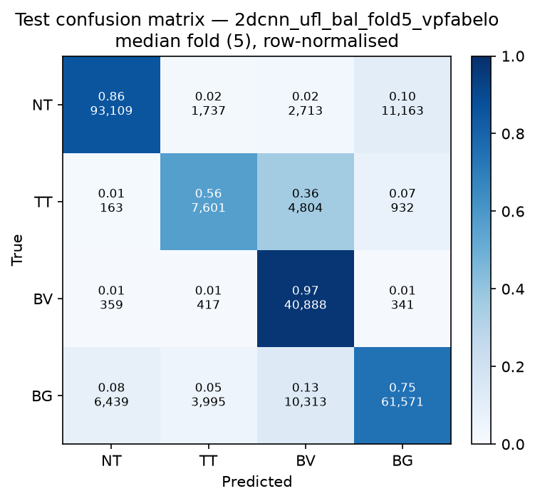

# Test-set evaluation — 2dcnn_ufl_bal_vpfabelo

| field | value |
|---|---|
| Model | 2D-CNN (patch) |
| Loss | UFL |
| Strategy | vp_fabelo |
| Folds | 1, 2, 3, 4, 5 |
| Patch size | 11 |
| Test images | 15 (012-01, 012-02, 019-01, 022-01, 022-02, 022-03, 037-01, 037-02, 037-03, 037-04, 038-01, 042-01, 042-02, 042-03, 053-01) |
| Labelled pixels | 246,545 |
| Median fold | 5 |
| Device | mps |
| Date | 2026-09-07 |

Metrics from `brainvision.metrics.compute_metrics` (pooled per-fold confusion matrix, labelled pixels only). Aggregate = median ± population std across folds.

## Per-fold results (%)

| Fold | Macro F1 | F1 no-BG | OA | TT Sens | NT F1 | TT F1 | BV F1 | BG F1 | Time (s) |
|---|---|---|---|---|---|---|---|---|---|
| 1 | 77.4 | 76.9 | 82.3 | 75.5 | 88.7 | 61.4 | 80.6 | 79.0 | 155.4 |
| 2 | 72.1 | 69.2 | 81.6 | 45.8 | 90.0 | 39.8 | 77.6 | 81.0 | 154.6 |
| 3 | 71.1 | 68.6 | 80.0 | 54.6 | 89.5 | 34.7 | 81.6 | 78.3 | 154.5 |
| 4 | 75.5 | 75.5 | 81.7 | 63.9 | 89.6 | 51.8 | 85.1 | 75.4 | 154.6 |
| 5 | 76.2 | 75.4 | 82.4 | 56.3 | 89.2 | 55.8 | 81.2 | 78.8 | 154.4 |

## Aggregate (median ± std, %)

| Metric | Median ± Std (%) |
|---|---|
| Macro F1 (all classes) | 75.5 ± 2.5 |
| Macro F1 (excl. Background) | 75.4 ± 3.5  ← primary |
| Overall accuracy | 81.7 ± 0.9 |
| Tumour Tissue sensitivity | 56.3 ± 10.0  ← clinical priority |

## Per-class aggregate (median ± std, %)

| Class | Sensitivity | Specificity | F1 |
|---|---|---|---|
| Normal Tissue (NT) | 85.8 ± 0.8 | 94.9 ± 0.3 | 89.5 ± 0.4 |
| Tumour Tissue (TT)  ← clinical priority | 56.3 ± 10.0 | 95.2 ± 2.2 | 51.8 ± 9.9 |
| Blood Vessel (BV) | 96.3 ± 2.8 | 91.5 ± 0.9 | 81.2 ± 2.4 |
| Background (BG) | 72.4 ± 2.7 | 94.4 ± 2.2 | 78.8 ± 1.8 |

