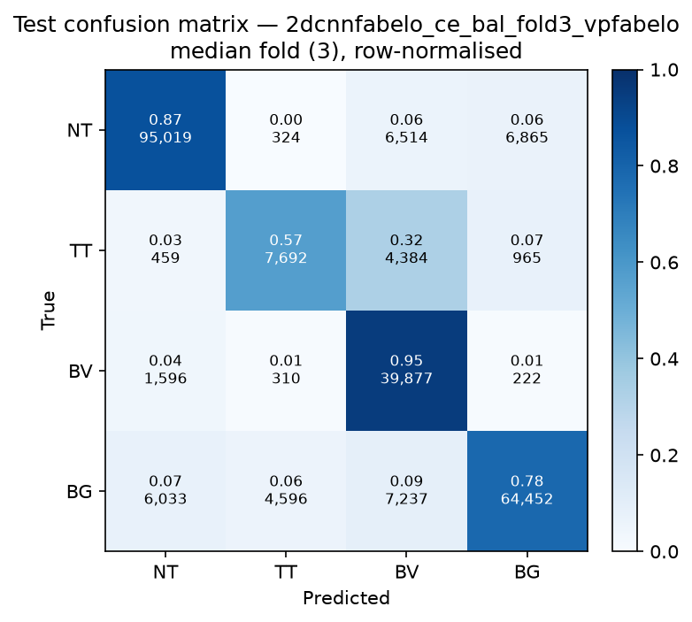

# Test-set evaluation — 2dcnnfabelo_ce_bal_vpfabelo

| field | value |
|---|---|
| Model | 2D-CNN-Fabelo (patch) |
| Loss | CE |
| Strategy | vp_fabelo |
| Folds | 1, 2, 3, 4, 5 |
| Patch size | 11 |
| Test images | 15 (012-01, 012-02, 019-01, 022-01, 022-02, 022-03, 037-01, 037-02, 037-03, 037-04, 038-01, 042-01, 042-02, 042-03, 053-01) |
| Labelled pixels | 246,545 |
| Median fold | 3 |
| Device | mps |
| Date | 2026-08-31 |

Metrics from `brainvision.metrics.compute_metrics` (pooled per-fold confusion matrix, labelled pixels only). Aggregate = median ± population std across folds.

## Per-fold results (%)

| Fold | Macro F1 | F1 no-BG | OA | TT Sens | NT F1 | TT F1 | BV F1 | BG F1 | Time (s) |
|---|---|---|---|---|---|---|---|---|---|
| 1 | 74.4 | 73.6 | 81.4 | 66.5 | 89.7 | 45.0 | 86.1 | 76.7 | 14.4 |
| 2 | 75.9 | 75.5 | 81.7 | 70.7 | 88.8 | 53.5 | 84.2 | 77.0 | 13.5 |
| 3 | 77.7 | 75.9 | 84.0 | 57.0 | 89.7 | 58.2 | 79.7 | 83.3 | 13.3 |
| 4 | 77.6 | 76.3 | 83.3 | 67.2 | 89.2 | 58.0 | 81.8 | 81.4 | 13.6 |
| 5 | 79.7 | 79.2 | 83.8 | 63.7 | 88.1 | 64.9 | 84.6 | 81.0 | 13.6 |

## Aggregate (median ± std, %)

| Metric | Median ± Std (%) |
|---|---|
| Macro F1 (all classes) | 77.6 ± 1.8 |
| Macro F1 (excl. Background) | 75.9 ± 1.8  ← primary |
| Overall accuracy | 83.3 ± 1.1 |
| Tumour Tissue sensitivity | 66.5 ± 4.6  ← clinical priority |

## Per-class aggregate (median ± std, %)

| Class | Sensitivity | Specificity | F1 |
|---|---|---|---|
| Normal Tissue (NT) | 86.4 ± 0.8 | 94.1 ± 0.7 | 89.2 ± 0.6 |
| Tumour Tissue (TT)  ← clinical priority | 66.5 ± 4.6 | 96.2 ± 2.1 | 58.0 ± 6.6 |
| Blood Vessel (BV) | 93.9 ± 0.8 | 94.1 ± 1.5 | 84.2 ± 2.3 |
| Background (BG) | 76.3 ± 3.8 | 93.3 ± 1.4 | 81.0 ± 2.6 |

