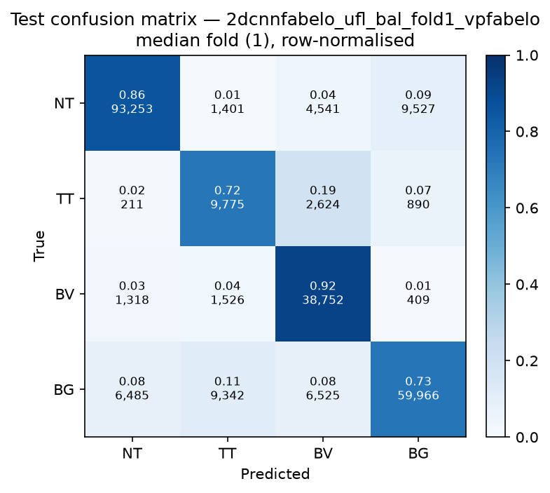

# Test-set evaluation — 2dcnnfabelo_ufl_bal_vpfabelo

| field | value |
|---|---|
| Model | 2D-CNN-Fabelo (patch) |
| Loss | UFL |
| Strategy | vp_fabelo |
| Folds | 1, 2, 3, 4, 5 |
| Patch size | 11 |
| Test images | 15 (012-01, 012-02, 019-01, 022-01, 022-02, 022-03, 037-01, 037-02, 037-03, 037-04, 038-01, 042-01, 042-02, 042-03, 053-01) |
| Labelled pixels | 246,545 |
| Median fold | 1 |
| Device | mps |
| Date | 2026-09-07 |

Metrics from `brainvision.metrics.compute_metrics` (pooled per-fold confusion matrix, labelled pixels only). Aggregate = median ± population std across folds.

## Per-fold results (%)

| Fold | Macro F1 | F1 no-BG | OA | TT Sens | NT F1 | TT F1 | BV F1 | BG F1 | Time (s) |
|---|---|---|---|---|---|---|---|---|---|
| 1 | 76.1 | 75.3 | 81.8 | 72.4 | 88.8 | 55.0 | 82.1 | 78.3 | 7.3 |
| 2 | 77.8 | 77.5 | 82.9 | 74.1 | 90.1 | 61.0 | 81.5 | 78.6 | 6.8 |
| 3 | 74.1 | 72.0 | 81.4 | 55.2 | 88.5 | 50.6 | 76.9 | 80.3 | 7.0 |
| 4 | 72.8 | 71.8 | 79.3 | 75.4 | 87.9 | 47.0 | 80.6 | 75.8 | 7.1 |
| 5 | 77.3 | 76.3 | 83.1 | 59.8 | 89.6 | 58.2 | 81.1 | 80.4 | 7.0 |

## Aggregate (median ± std, %)

| Metric | Median ± Std (%) |
|---|---|
| Macro F1 (all classes) | 76.1 ± 1.9 |
| Macro F1 (excl. Background) | 75.3 ± 2.3  ← primary |
| Overall accuracy | 81.8 ± 1.4 |
| Tumour Tissue sensitivity | 72.4 ± 8.3  ← clinical priority |

## Per-class aggregate (median ± std, %)

| Class | Sensitivity | Specificity | F1 |
|---|---|---|---|
| Normal Tissue (NT) | 85.8 ± 0.6 | 94.2 ± 1.3 | 88.8 ± 0.8 |
| Tumour Tissue (TT)  ← clinical priority | 72.4 ± 8.3 | 96.0 ± 2.0 | 55.0 ± 5.0 |
| Blood Vessel (BV) | 94.1 ± 5.9 | 92.1 ± 2.2 | 81.1 ± 1.8 |
| Background (BG) | 72.8 ± 2.1 | 93.4 ± 1.4 | 78.6 ± 1.7 |

