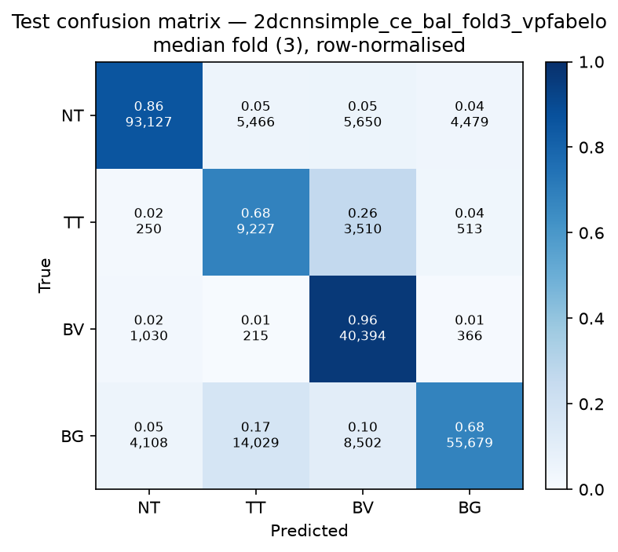

# Test-set evaluation — 2dcnnsimple_ce_bal_vpfabelo

| field | value |
|---|---|
| Model | 2D-CNN-Simple (patch) |
| Loss | CE |
| Strategy | vp_fabelo |
| Folds | 1, 2, 3, 4, 5 |
| Patch size | 11 |
| Test images | 15 (012-01, 012-02, 019-01, 022-01, 022-02, 022-03, 037-01, 037-02, 037-03, 037-04, 038-01, 042-01, 042-02, 042-03, 053-01) |
| Labelled pixels | 246,545 |
| Median fold | 3 |
| Device | mps |
| Date | 2026-08-31 |

Metrics from `brainvision.metrics.compute_metrics` (pooled per-fold confusion matrix, labelled pixels only). Aggregate = median ± population std across folds.

## Per-fold results (%)

| Fold | Macro F1 | F1 no-BG | OA | TT Sens | NT F1 | TT F1 | BV F1 | BG F1 | Time (s) |
|---|---|---|---|---|---|---|---|---|---|
| 1 | 71.7 | 69.3 | 79.0 | 69.1 | 87.2 | 40.8 | 79.9 | 79.1 | 10.9 |
| 2 | 77.8 | 76.7 | 83.1 | 75.3 | 89.0 | 58.3 | 82.8 | 81.1 | 9.9 |
| 3 | 72.9 | 71.4 | 80.5 | 68.3 | 89.9 | 43.5 | 80.7 | 77.7 | 9.6 |
| 4 | 69.9 | 69.7 | 77.9 | 60.3 | 89.6 | 36.6 | 83.1 | 70.5 | 9.5 |
| 5 | 80.7 | 79.6 | 85.7 | 58.4 | 90.2 | 64.1 | 84.5 | 83.9 | 9.1 |

## Aggregate (median ± std, %)

| Metric | Median ± Std (%) |
|---|---|
| Macro F1 (all classes) | 72.9 ± 4.0 |
| Macro F1 (excl. Background) | 71.4 ± 4.1  ← primary |
| Overall accuracy | 80.5 ± 2.8 |
| Tumour Tissue sensitivity | 68.3 ± 6.2  ← clinical priority |

## Per-class aggregate (median ± std, %)

| Class | Sensitivity | Specificity | F1 |
|---|---|---|---|
| Normal Tissue (NT) | 85.7 ± 2.6 | 95.2 ± 0.9 | 89.6 ± 1.1 |
| Tumour Tissue (TT)  ← clinical priority | 68.3 ± 6.2 | 91.5 ± 3.3 | 43.5 ± 10.7 |
| Blood Vessel (BV) | 96.2 ± 1.5 | 92.5 ± 0.9 | 82.8 ± 1.7 |
| Background (BG) | 72.1 ± 6.9 | 95.0 ± 1.5 | 79.1 ± 4.5 |

