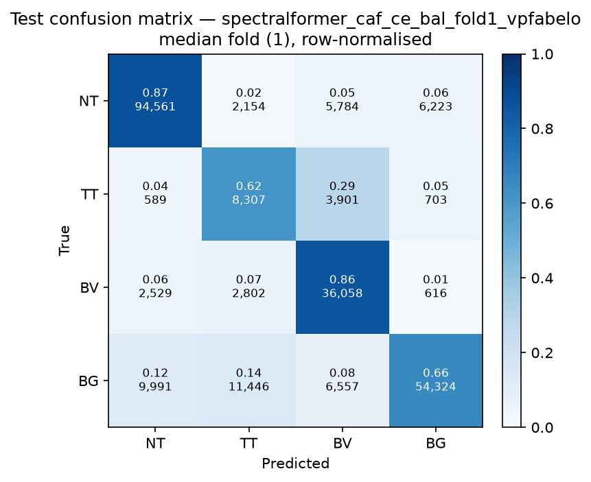

# Test-set evaluation — spectralformer_caf_ce_bal_vpfabelo

| field | value |
|---|---|
| Model | SpectralFormer (pixel) |
| Loss | CE |
| Strategy | vp_fabelo |
| Folds | 1, 2, 3, 4, 5 |
| Patch size | -- |
| Test images | 15 (012-01, 012-02, 019-01, 022-01, 022-02, 022-03, 037-01, 037-02, 037-03, 037-04, 038-01, 042-01, 042-02, 042-03, 053-01) |
| Labelled pixels | 246,545 |
| Median fold | 1 |
| Device | mps |
| Date | 2026-09-07 |

Metrics from `brainvision.metrics.compute_metrics` (pooled per-fold confusion matrix, labelled pixels only). Aggregate = median ± population std across folds.

## Per-fold results (%)

| Fold | Macro F1 | F1 no-BG | OA | TT Sens | NT F1 | TT F1 | BV F1 | BG F1 | Time (s) |
|---|---|---|---|---|---|---|---|---|---|
| 1 | 70.7 | 69.1 | 78.4 | 61.5 | 87.4 | 43.5 | 76.5 | 75.4 | 42.1 |
| 2 | 75.6 | 74.9 | 82.0 | 67.0 | 89.6 | 51.3 | 83.8 | 77.6 | 42.1 |
| 3 | 68.5 | 68.5 | 76.8 | 64.1 | 89.8 | 35.1 | 80.5 | 68.4 | 40.3 |
| 4 | 71.4 | 70.0 | 79.1 | 65.0 | 88.9 | 43.7 | 77.4 | 75.8 | 40.2 |
| 5 | 69.8 | 68.8 | 77.6 | 64.0 | 88.3 | 42.5 | 75.6 | 72.7 | 40.3 |

## Aggregate (median ± std, %)

| Metric | Median ± Std (%) |
|---|---|
| Macro F1 (all classes) | 70.7 ± 2.4 |
| Macro F1 (excl. Background) | 69.1 ± 2.4  ← primary |
| Overall accuracy | 78.4 ± 1.8 |
| Tumour Tissue sensitivity | 64.1 ± 1.7  ← clinical priority |

## Per-class aggregate (median ± std, %)

| Class | Sensitivity | Specificity | F1 |
|---|---|---|---|
| Normal Tissue (NT) | 87.0 ± 0.8 | 93.8 ± 1.9 | 88.9 ± 0.9 |
| Tumour Tissue (TT)  ← clinical priority | 64.1 ± 1.7 | 92.3 ± 2.0 | 43.5 ± 5.1 |
| Blood Vessel (BV) | 89.4 ± 3.7 | 91.4 ± 1.2 | 77.4 ± 3.0 |
| Background (BG) | 66.0 ± 6.4 | 95.4 ± 2.0 | 75.4 ± 3.2 |

