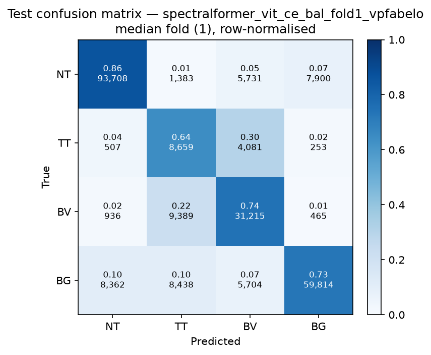

# Test-set evaluation — spectralformer_vit_ce_bal_vpfabelo

| field | value |
|---|---|
| Model | SpectralFormer (pixel) |
| Loss | CE |
| Strategy | vp_fabelo |
| Folds | 1, 2, 3, 4, 5 |
| Patch size | -- |
| Test images | 15 (012-01, 012-02, 019-01, 022-01, 022-02, 022-03, 037-01, 037-02, 037-03, 037-04, 038-01, 042-01, 042-02, 042-03, 053-01) |
| Labelled pixels | 246,545 |
| Median fold | 1 |
| Device | mps |
| Date | 2026-09-07 |

Metrics from `brainvision.metrics.compute_metrics` (pooled per-fold confusion matrix, labelled pixels only). Aggregate = median ± population std across folds.

## Per-fold results (%)

| Fold | Macro F1 | F1 no-BG | OA | TT Sens | NT F1 | TT F1 | BV F1 | BG F1 | Time (s) |
|---|---|---|---|---|---|---|---|---|---|
| 1 | 70.0 | 66.8 | 78.4 | 64.1 | 88.3 | 41.9 | 70.4 | 79.4 | 37.2 |
| 2 | 75.7 | 73.5 | 82.7 | 67.4 | 90.5 | 51.6 | 78.5 | 82.0 | 35.9 |
| 3 | 67.7 | 66.3 | 77.2 | 47.9 | 88.5 | 28.4 | 82.0 | 72.1 | 35.6 |
| 4 | 72.7 | 70.4 | 81.1 | 55.7 | 89.1 | 42.1 | 80.0 | 79.6 | 35.7 |
| 5 | 68.0 | 66.1 | 77.5 | 50.8 | 89.1 | 32.3 | 77.0 | 73.5 | 35.7 |

## Aggregate (median ± std, %)

| Metric | Median ± Std (%) |
|---|---|
| Macro F1 (all classes) | 70.0 ± 3.0 |
| Macro F1 (excl. Background) | 66.8 ± 2.9  ← primary |
| Overall accuracy | 78.4 ± 2.2 |
| Tumour Tissue sensitivity | 55.7 ± 7.5  ← clinical priority |

## Per-class aggregate (median ± std, %)

| Class | Sensitivity | Specificity | F1 |
|---|---|---|---|
| Normal Tissue (NT) | 86.9 ± 0.7 | 92.9 ± 1.5 | 89.1 ± 0.7 |
| Tumour Tissue (TT)  ← clinical priority | 55.7 ± 7.5 | 91.8 ± 2.0 | 41.9 ± 8.2 |
| Blood Vessel (BV) | 90.6 ± 7.9 | 92.0 ± 0.7 | 78.5 ± 4.0 |
| Background (BG) | 70.3 ± 7.2 | 96.8 ± 1.6 | 79.4 ± 3.8 |

