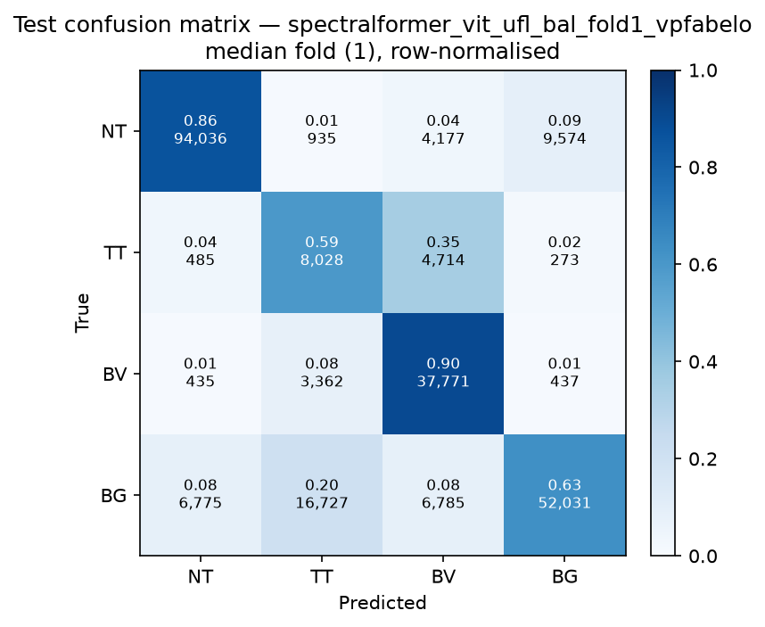

# Test-set evaluation — spectralformer_vit_ufl_bal_vpfabelo

| field | value |
|---|---|
| Model | SpectralFormer (pixel) |
| Loss | UFL |
| Strategy | vp_fabelo |
| Folds | 1, 2, 3, 4, 5 |
| Patch size | -- |
| Test images | 15 (012-01, 012-02, 019-01, 022-01, 022-02, 022-03, 037-01, 037-02, 037-03, 037-04, 038-01, 042-01, 042-02, 042-03, 053-01) |
| Labelled pixels | 246,545 |
| Median fold | 1 |
| Device | mps |
| Date | 2026-09-07 |

Metrics from `brainvision.metrics.compute_metrics` (pooled per-fold confusion matrix, labelled pixels only). Aggregate = median ± population std across folds.

## Per-fold results (%)

| Fold | Macro F1 | F1 no-BG | OA | TT Sens | NT F1 | TT F1 | BV F1 | BG F1 | Time (s) |
|---|---|---|---|---|---|---|---|---|---|
| 1 | 69.5 | 68.7 | 77.8 | 59.5 | 89.4 | 37.7 | 79.1 | 71.9 | 36.6 |
| 2 | 74.8 | 72.4 | 82.6 | 62.5 | 90.5 | 46.7 | 80.1 | 81.9 | 35.7 |
| 3 | 67.9 | 66.5 | 77.2 | 51.9 | 89.4 | 33.0 | 77.1 | 72.0 | 35.7 |
| 4 | 67.3 | 65.6 | 76.7 | 50.9 | 89.6 | 28.2 | 79.1 | 72.2 | 35.5 |
| 5 | 70.4 | 68.9 | 78.1 | 71.6 | 89.5 | 44.3 | 72.8 | 75.1 | 35.6 |

## Aggregate (median ± std, %)

| Metric | Median ± Std (%) |
|---|---|
| Macro F1 (all classes) | 69.5 ± 2.7 |
| Macro F1 (excl. Background) | 68.7 ± 2.4  ← primary |
| Overall accuracy | 77.8 ± 2.1 |
| Tumour Tissue sensitivity | 59.5 ± 7.6  ← clinical priority |

## Per-class aggregate (median ± std, %)

| Class | Sensitivity | Specificity | F1 |
|---|---|---|---|
| Normal Tissue (NT) | 87.0 ± 0.6 | 94.1 ± 1.1 | 89.5 ± 0.4 |
| Tumour Tissue (TT)  ← clinical priority | 59.5 ± 7.6 | 91.0 ± 1.9 | 37.7 ± 6.9 |
| Blood Vessel (BV) | 91.6 ± 3.4 | 91.8 ± 1.4 | 79.1 ± 2.6 |
| Background (BG) | 62.8 ± 6.4 | 97.5 ± 1.7 | 72.2 ± 3.8 |

